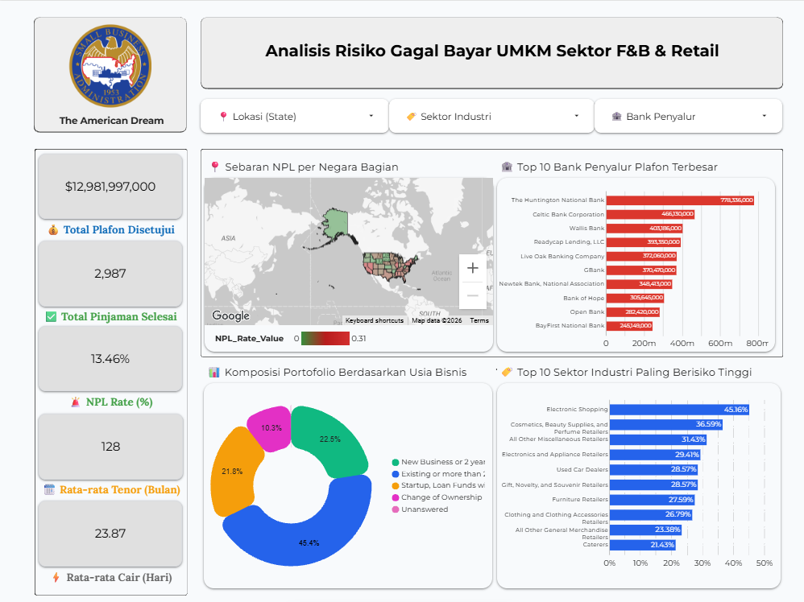

# SBA Small-Business Loan Risk Dashboard

Analyzing which small-business segments carry the highest loan-default risk, using official U.S. government loan-guarantee data.

  

  <a href="https://datastudio.google.com/s/rWWUUX-6Yig"><strong>Open Live Dashboard →</strong></a>

## Contents
- [Business Problem](#business-problem)
- [Data](#data)
- [Tools & Techniques](#tools--techniques)
- [Key Findings](#key-findings)
- [Recommendation](#recommendation)
- [Limitations](#limitations)

## Business Problem
Government-backed small-business loan programs (like the U.S. SBA 7(a), structurally similar to Indonesia's KUR scheme) need to understand which sectors and lenders carry disproportionate default risk, so guarantee capacity and risk oversight can be allocated accordingly.

## Data
- **Source:** Official U.S. Small Business Administration data (data.sba.gov), FY2020–Present
- **Scope:** Filtered to Food & Beverage (NAICS 72) and Retail (NAICS 44-45) sectors, chosen deliberately for relevance to prior QRIS/UMKM payment-ecosystem work at Bank Indonesia
- **Resolution filter:** Only loans with a final outcome, Paid in Full (PIF) or Charged Off (CHGOFF): 2,987 loans. Still-active loans were excluded so the default-rate metric isn't biased by loans that haven't had time to succeed or fail yet.

### Why this dataset
SBA loan-level data has been a teaching and research staple since Li, Mickel & Taylor's 2018 paper in the *Journal of Statistics Education* introduced it for statistical-modeling instruction; it has since been reused widely for ML projects on Kaggle, GitHub, and coursework (e.g. Kaggle's "Should This Loan Be Approved Or Denied?", ~900K rows). It's also one of the most transparent government credit datasets available. Every SBA 7(a)/504 loan since the 1990s is disclosed under FOIA, including well-known past recipients like early-stage FedEx and Apple. That combination of academic pedigree and real disclosed outcomes (not anonymized or synthetic) is why it was chosen here over a synthetic credit-risk dataset.

## Tools & Techniques
Looker Studio, data cleaning (corrected a mis-scaled tenor field found during validation), geographic and sector-level aggregation with small-sample filtering

## Key Findings

| Metric | Value |
|---|---|
| Total disbursed | **~$12.98B** across 2,987 resolved loans |
| Overall NPL (default) rate | **13.46%** |
| Average tenor | 128 months (~10.6 years) |
| Average approval-to-disbursement time | 23.9 days |
| Largest lender by volume | The Huntington National Bank ($778M) |
| Riskiest sub-sector | Electronic Shopping (45.16% NPL) |
| Safest sub-sector | Caterers (21.43% NPL) |

- Overall NPL rate of 13.46% sits above healthy commercial-bank benchmarks (~5%), though SMB lending carries structurally higher risk than corporate lending globally.
- **The Huntington National Bank** is the largest lender by volume, well ahead of #2 Celtic Bank Corporation ($466M).
- **Electronic Shopping** is the riskiest sub-sector, followed by Cosmetics & Beauty Supplies (36.59%). High-value, trend-sensitive retail categories carry more risk than essential F&B categories.
- State-level risk maps are deliberately limited to states with ≥10 loans to avoid small-sample distortion.

## Recommendation
Tighten credit scoring for high-value, trend-sensitive retail sub-sectors. Monitor higher-NPL states (Hawaii, New York among sufficiently-sampled states) for regional policy review. Consider risk-management training partnerships with high-volume lenders given their concentrated exposure.

## Limitations
Analysis is restricted to loans with a final outcome (PIF/CHGOFF), so more recently originated loans are under-represented. This is a snapshot of historically resolved risk, not a real-time predictor. Findings are U.S.-specific; applying the same *methodology* to Indonesian KUR/UMKM credit data would require access to equivalent loan-level records.

---

**Muhammad Yahya Ayyasy** · [LinkedIn](https://linkedin.com/in/muhammadayyass) · [muhammadayyas22@gmail.com](mailto:muhammadayyas22@gmail.com)
